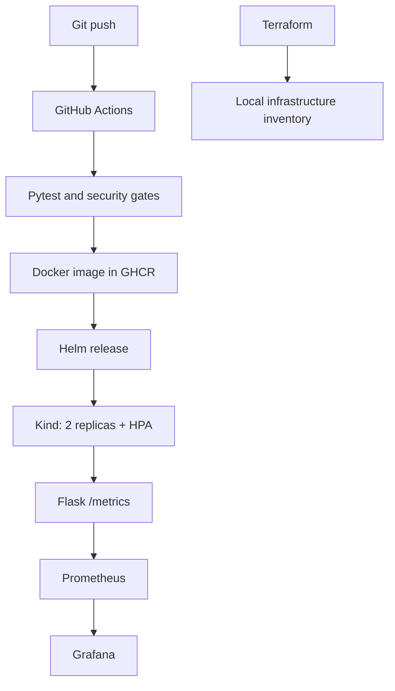

# Architecture

```mermaid
flowchart TB
  Git[Git push] --> Actions[GitHub Actions]
  Actions --> Gates[Pytest and security gates]
  Gates --> Image[Docker image in GHCR]
  Image --> Helm[Helm release]
  Helm --> Kind[Kind: 2 replicas + HPA]
  Kind --> Metrics[Flask /metrics]
  Metrics --> Prometheus --> Grafana
  Terraform --> Inventory[Local infrastructure inventory]
```

Compose owns supporting local services; Helm owns application Kubernetes objects; Terraform owns only the inventory artifact. This avoids competing resource ownership.
